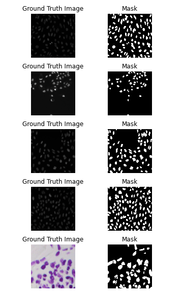
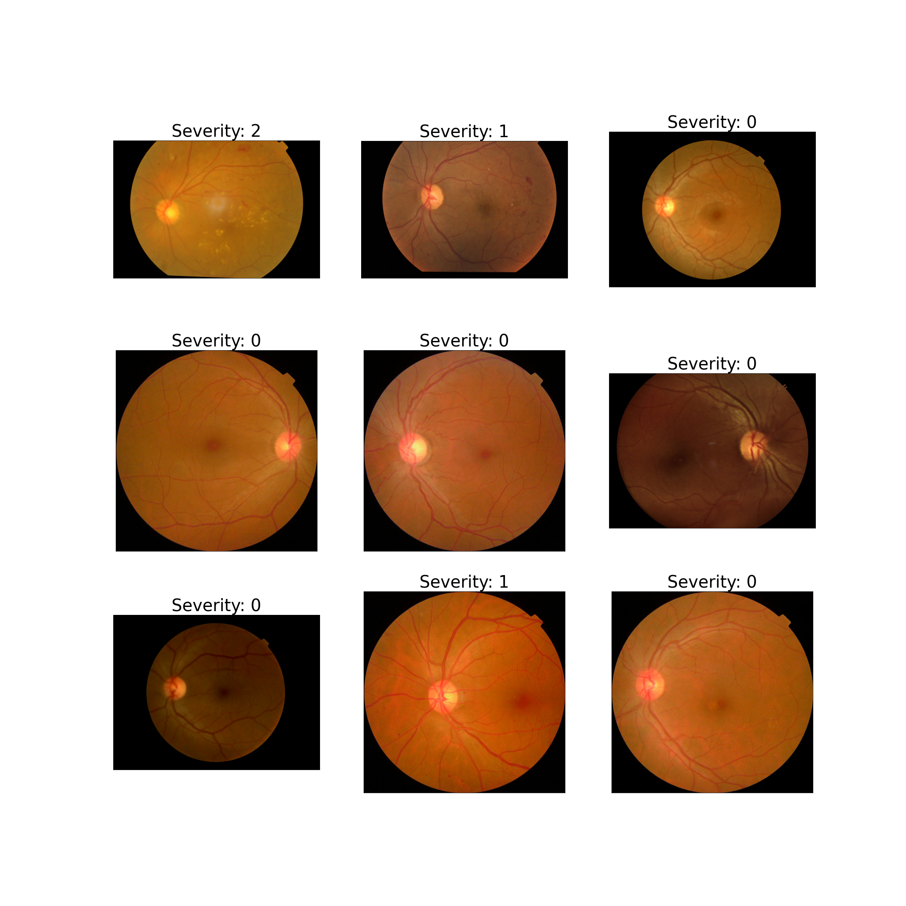

:py:mod:`~farabio.data.biodatasets` Module
==================================================

:py:mod:`~farabio.data.biodatasets` module provides classes to load public biomedical datasets
in a PyTorch friendly manner.

:py:class:`~.ChestXrayDataset` Class
------------------------------------------------------------------------------

Load :py:class:`~.ChestXrayDataset` dataset
^^^^^^^^^^^^^^^^^^^^^^^^^^^^^^^^^^^^^^^^^^^^^^^^^^^^^^^^^^
.. code-block:: python

   train_dataset = ChestXrayDataset(root=".", transform=None, download=True)
   train_dataset.visualize_dataset()

.. image:: ../imgs/ChestXrayDataset.png
   :width: 300

Docs of :py:class:`~.ChestXrayDataset`
^^^^^^^^^^^^^^^^^^^^^^^^^^^^^^^^^^^^^^^^^^^^^
.. autoclass:: farabio.data.biodatasets.ChestXrayDataset
   :members:

:py:class:`~.DSB18Dataset` Class
------------------------------------------------------------------------------

Load :py:class:`~.DSB18Dataset` dataset
^^^^^^^^^^^^^^^^^^^^^^^^^^^^^^^^^^^^^^^^^^^^^^^^^^^^^^^^^^
.. code-block:: python

   train_dataset = DSB18Dataset(root=".", transform=None, download=False)
   dsb18_plt = train_dataset.visualize_dataset(5)
   dsb18_plt.show()

Docs of :py:class:`~.DSB18Dataset`
^^^^^^^^^^^^^^^^^^^^^^^^^^^^^^^^^^^^^
.. autoclass:: farabio.data.biodatasets.DSB18Dataset
   :members:

:py:class:`~.RetinopathyDataset` Class
------------------------------------------------------------------------------

Load :py:class:`~.RetinopathyDataset` dataset
^^^^^^^^^^^^^^^^^^^^^^^^^^^^^^^^^^^^^^^^^^^^^^^^^^^^^^^^^^^^^
.. code-block:: python

   train_dataset = RetinopathyDataset(root=".", transform=None, download=True)
   train_dataset.visualize_dataset(9)

Docs of :py:class:`~.RetinopathyDataset`
^^^^^^^^^^^^^^^^^^^^^^^^^^^^^^^^^^^^^^^^^^
.. autoclass:: farabio.data.biodatasets.RetinopathyDataset
   :members:

:py:class:`~farabio.data.biodatasets.HistocancerDataset` Class
------------------------------------------------------------------------------
.. autoclass:: farabio.data.biodatasets.HistocancerDataset
   :members:
