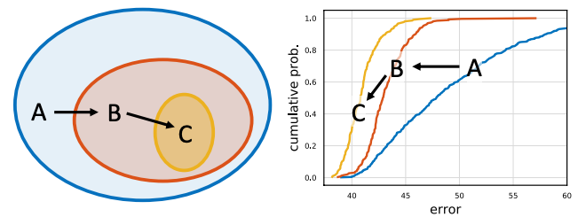
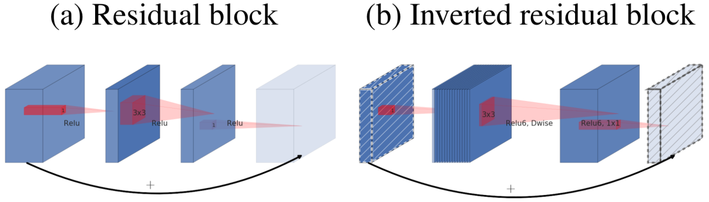
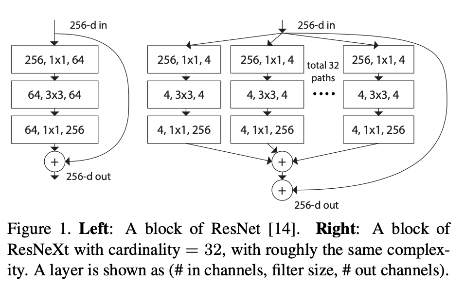
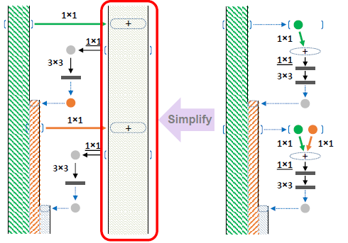

:py:mod:`~farabio.models.classification.class_trainer` Module
=========================================================================

:py:class:`~.ClassTrainer` class offers several classification models.

Available architectures
**************************

.. list-table:: CIFAR10-classification
   :widths: 25 25
   :header-rows: 1

   * - Model
     - Accuracy for CIFAR10
   * - `VGG16`_
     - 92.64%
   * - `ResNet18`_
     - 93.02%
   * - `ResNet50`_
     - 93.62%
   * - `ResNet101`_
     - 93.75%
   * - `RegNetX_200MF`_
     - 94.24%
   * - `RegNetY_400MF`_
     - 94.29% 
   * - `MobileNetV2`_
     - 94.43%
   * - `ResNeXt29(32x4d)`_
     - 94.73%
   * - `ResNeXt29(2x64d)`_
     - 94.82%
   * - `SimpleDLA`_
     - 94.89%
   * - `DenseNet121`_
     - 95.04%
   * - `PreActResNet18`_
     - 95.11%
   * - `DPN92`_
     - 95.16%
   * - `DLA`_
     - 95.47%

:py:class:`farabio.models.classification.arch.vgg.VGG`

.. image:: ../imgs/vgg.png
   :width: 400

:py:class:`farabio.models.classification.arch.resnet.ResNet`

.. image:: ../imgs/resnet.png
   :width: 600

:py:class:`farabio.models.classification.arch.resnet.RegNet`

:py:class:`farabio.models.classification.arch.mobilenetv2.MobileNetV2`

:py:class:`farabio.models.classification.arch.resnext.ResNeXt`

:py:class:`farabio.models.classification.arch.densenet.DenseNet`

.. image:: ../imgs/densenet.png
   :width: 400

:py:class:`farabio.models.classification.arch.preact_resnet.PreActResNet`

.. image:: ../imgs/preactresnet.png
   :width: 250

:py:class:`farabio.models.classification.arch.dpn.DPN`

:py:class:`farabio.models.classification.arch.dla_simple.SimpleDLA`

.. image:: ../imgs/simpledla.png
   :width: 600

************
References
************

.. target-notes::

.. _`VGG16`: https://arxiv.org/abs/1409.1556
.. _`ResNet18`: https://arxiv.org/abs/1512.03385
.. _`ResNet50`: https://arxiv.org/abs/1512.03385
.. _`ResNet101`: https://arxiv.org/abs/1512.03385
.. _`RegNetX_200MF`: https://arxiv.org/abs/2003.13678
.. _`RegNetY_400MF`: https://arxiv.org/abs/2003.13678
.. _`MobileNetV2`: https://arxiv.org/abs/1801.04381
.. _`ResNeXt29(32x4d)`: https://arxiv.org/abs/1611.05431
.. _`ResNeXt29(2x64d)`: https://arxiv.org/abs/1611.05431
.. _`DenseNet121`: https://arxiv.org/abs/1608.06993
.. _`PreActResNet18`: https://arxiv.org/abs/1603.05027
.. _`DPN92`: https://arxiv.org/abs/1707.01629
.. _`SimpleDLA`: https://arxiv.org/abs/1707.064
.. _`DLA`: https://arxiv.org/pdf/1707.06484.pdf

:py:class:`~.ClassTrainer` class
-----------------------------------------

.. autoclass:: farabio.models.classification.class_trainer.ClassTrainer
   :members:
