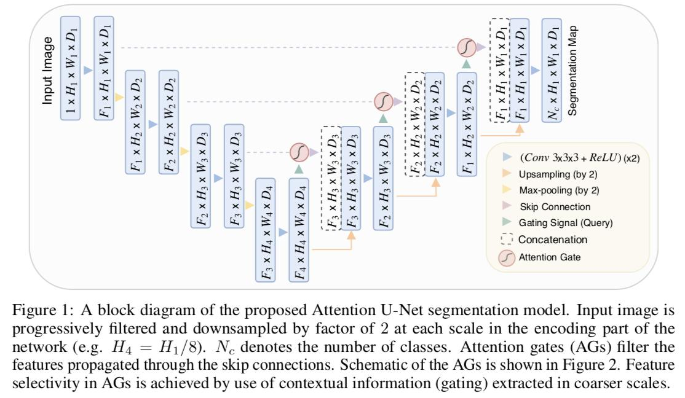

:py:mod:`~farabio.models.segmentation.attunet.attunet_trainer` Module
=========================================================================

:py:class:`~.AttunetTrainer` class uses Attention U-Net model, which is originally proposed in this `arXiv`_. 
Implemented trainer module uses this `Git`_ code as reference work.

************
References
************

.. target-notes::

.. _`arXiv`: https://arxiv.org/abs/1804.03999
.. _`Git`: https://github.com/LeeJunHyun/Image_Segmentation

:py:class:`~.AttunetTrainer` class
-----------------------------------------

.. autoclass:: farabio.models.segmentation.attunet.attunet_trainer.AttunetTrainer
   :members: